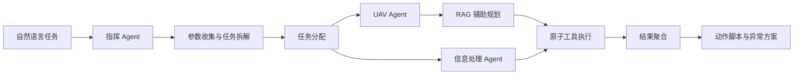

# UAV Agent

面向无人机电磁侦察任务的本地多智能体规划与执行原型。系统使用 LangGraph 编排指挥 Agent、UAV Agent 与信息处理 Agent，结合 Ollama 本地模型、RAG 知识库、Redis 状态存储和 MCP 工具调用，将自然语言任务逐步转换为可执行动作脚本与异常应对方案。


## 特性

- **多智能体协作**：指挥 Agent 负责参数收集、任务拆解、分配与结果聚合，子 Agent 独立完成规划和执行。
- **分层任务规划**：将自然语言需求转换为宏观规划、详细规划和原子动作。
- **知识增强生成**：从任务示例、约束 SOP、阶段拆解和任务分解四类知识中检索规划上下文。
- **本地模型推理**：通过 Ollama 运行对话、Embedding 与 Reranker 模型，任务数据无需发送至云端模型。
- **工具化执行**：通过 MCP stdio 接入路径规划工具，其余算法以本地 Stub 形式提供能力占位。
- **两种使用方式**：提供交互式 CLI，以及适合前端集成的同步 HTTP API。
- **结构化产物**：输出动作步骤、步骤依赖关系和异常应对方案 JSON。

## 工作流程



所有 Agent 在同一进程内通过异步 `MemoryBus` 通信。Redis 用于保存会话、结构化上下文和 Agent 状态；MCP Server 作为子进程由应用自动启动。

## 技术栈

| 组件 | 用途 |
| --- | --- |
| LangGraph / LangChain | Agent 状态图、模型与工具编排 |
| Ollama | 本地对话模型、Embedding 和重排 |
| ChromaDB | RAG 向量索引持久化 |
| Redis | 会话与共享上下文存储 |
| MCP | 算法工具发现与调用 |
| FastAPI | HTTP 服务 |

## 快速开始

### 1. 环境要求

- Python 3.11 或更高版本
- [Ollama](https://ollama.com/)
- Redis 7（推荐使用 Docker 启动）
- Windows：如需真实执行 `path_planning`，还需准备对应的可执行文件

### 2. 获取代码并安装依赖

```bash
git clone https://github.com/MyLifeForVioletE/uav-agent.git
cd uav-agent

python -m venv .venv
```

激活虚拟环境：

```powershell
# Windows PowerShell
.\.venv\Scripts\Activate.ps1
```

```bash
# Linux / macOS
source .venv/bin/activate
```

安装项目依赖：

```bash
python -m pip install -r requirements.txt
```

如需启动 HTTP API，还需要安装当前 `requirements.txt` 未包含的服务依赖：

```bash
python -m pip install fastapi uvicorn
```

### 3. 准备 Ollama 模型

```bash
ollama pull ExpedientFalcon/qwen3-4b-agent:latest
ollama pull bge-m3:latest
ollama pull qllama/bge-reranker-v2-m3:latest
```

多 UAV 并发运行时，建议在启动 Ollama 服务前设置并行参数：

```powershell
# Windows PowerShell
$env:OLLAMA_NUM_PARALLEL=8
$env:OLLAMA_MAX_LOADED_MODELS=4
ollama serve
```

```bash
# Linux / macOS
OLLAMA_NUM_PARALLEL=8 OLLAMA_MAX_LOADED_MODELS=4 ollama serve
```

显存不足时请降低 `OLLAMA_NUM_PARALLEL` 或 `OLLAMA_MAX_LOADED_MODELS`。

### 4. 启动 Redis

```bash
docker run -d --name uav-redis \
  -p 6379:6379 \
  -v uav-redis-data:/data \
  --restart unless-stopped \
  redis:7-alpine
```

### 5. 配置算法路径

[`algorithms.json`](./algorithms.json) 中的算法可执行文件路径来自开发环境。当前只有 `path_planning` 会通过 MCP 真实调用外部 EXE；运行前请将其 `executable` 修改为本机路径。若文件不存在，该工具会返回错误，其余算法仍以 Stub 方式运行。

### 6. 启动应用

交互式 CLI：

```bash
python main.py
```

HTTP API：

```bash
python -m uvicorn http_server:app --host 0.0.0.0 --port 8000
```

首次启动会连接 Ollama、启动 MCP 子进程并初始化或增量更新 ChromaDB 索引，因此可能需要等待一段时间。

## 使用示例

### CLI

启动后输入任务描述，并按提示补充或确认规划：

```text
>>> 使用一架侦察无人机前往目标区域，扫描 2~3 GHz 频段并实时回传结果。
```

交互流程通常为：

```text
任务描述 → 参数确认 → 子任务分配 → 宏观规划确认 → 详细规划确认 → 工具执行
```

输入 `exit` 结束会话。

### HTTP API

检查服务状态：

```bash
curl http://127.0.0.1:8000/api/health
```

提交任务：

```bash
curl -X POST http://127.0.0.1:8000/api/run \
  -H "Content-Type: application/json" \
  -d '{"scenario":"使用一架侦察无人机前往目标区域，扫描 2~3 GHz 频段并实时回传结果。"}'
```

成功响应的顶层结构如下：

```json
{
  "actions": {
    "steps": [],
    "dependencies": []
  },
  "contingency": {
    "plan": []
  }
}
```

`POST /api/run` 是同步阻塞接口，复杂任务可能耗时数分钟。完整字段定义请参阅 [`api_接口文档.txt`](./api_%E6%8E%A5%E5%8F%A3%E6%96%87%E6%A1%A3.txt)。

## 项目结构

```text
uav-agent/
├── agent/                  # 指挥、UAV、信息处理 Agent 及状态图节点
│   ├── coordinator/        # 指挥 Agent 图
│   ├── executors/          # 原子动作执行器
│   └── nodes/              # 子 Agent 图节点
├── core/                   # 配置、状态、Prompt、Redis 与进程内消息总线
├── fleet/                  # 多机任务分配与生命周期管理
├── rag/                    # 检索、重排与任务规划
├── rag_docs/               # RAG 知识文档
├── schema/                 # 场景、任务与规划 JSON Schema
├── skills/                 # Agent 技能指令
├── tools/                  # MCP Server、Stub 工具与脚本生成器
├── chroma_db/              # 本地向量索引
├── output/                 # 动作脚本与异常方案输出
├── algorithms.json         # 12 项算法能力及其输入输出定义
├── http_server.py          # FastAPI 服务入口
└── main.py                 # 交互式 CLI 入口
```

## Agent 架构

| Agent | 主要职责 | 实现位置 |
| --- | --- | --- |
| 指挥 Agent | 收集参数、拆解和分配任务、协调确认、聚合结果 | `agent/coordinator/` |
| UAV Agent | 生成宏观与详细规划，执行飞行或侦察类动作 | `agent/sub_agent.py` |
| 信息处理 Agent | 匹配分析工具并处理采集结果 | `agent/analyst_graph.py` |

RAG 使用四个独立 Collection：

| Collection | 内容来源 |
| --- | --- |
| `macro_rag` | `rag_docs/macro_examples/` |
| `constraint_rag` | `rag_docs/constraint_sop/` |
| `detail_rag` | `rag_docs/phase_decmposition/` |
| `decomposer_rag` | `rag_docs/task_decomposition/` |

## 配置

当前服务地址与模型名称集中定义在 [`core/config.py`](./core/config.py)：

| 配置 | 默认值 |
| --- | --- |
| Ollama | `http://127.0.0.1:11434` |
| 对话模型 | `ExpedientFalcon/qwen3-4b-agent:latest` |
| Redis | `127.0.0.1:6379/0` |

如需切换模型、端口或远程服务，请修改该文件。RAG 的 Embedding 与 Reranker 模型目前分别在 `rag/retriever.py` 和 `rag/reranker.py` 中配置。

## 输出文件

任务完成后，系统会在 `output/` 下生成与会话 ID 关联的文件：

- `actions_script_<session_id>.json`：动作步骤及依赖关系
- `contingency_plan_<session_id>.json`：各动作的异常应对方案

这些文件可能包含任务参数或运行结果，提交代码前请确认其中不含敏感信息。

## 已知限制

- 除 `path_planning` 外，当前算法能力均为 Stub，不会执行真实算法程序。
- `path_planning` 使用 Windows EXE，且仓库中的默认路径不可移植。
- HTTP 接口采用同步长请求模式，暂未提供任务队列、进度查询或取消机制。
- 服务地址和模型名称仍以代码常量配置，尚未支持环境变量或配置文件覆盖。
- 仓库目前没有自动化测试和 CI 配置。

## 参与开发

欢迎通过 Issue 报告问题或提交 Pull Request。提交改动时建议：

1. 从独立分支开发，并保持提交内容聚焦。
2. 不提交本机 EXE 路径、密钥、敏感任务数据或无关的生成文件。
3. 若修改规划结构，同步更新 `schema/`、示例知识文档和接口说明。
4. 在 PR 中说明验证环境、运行命令以及真实工具或 Stub 工具的使用情况。

## License

仓库当前尚未提供开源许可证。在许可证补充之前，源代码默认保留全部权利；如需使用、修改或分发，请先联系仓库维护者。
